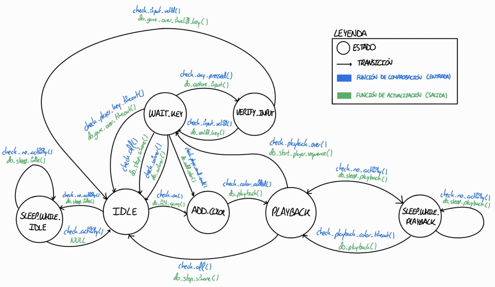

# Proyecto Simone - Juego de Memoria con FSM

Acceso a la documentación y API del proyecto en [este enlace](https://sdg2dieupm.github.io/simone/).

## Authors

* **Jorge Arias Ávila** - email: [jo.arias@alumno.upm.es](mailto:alumno@alumno.upm.es)

**Descripción del Proyecto (ES):** 
Este proyecto implementa el clásico juego de memoria "Simone" (estilo Simon Says) sobre una placa STM32F4. El sistema genera secuencias aleatorias de colores a través de un LED RGB que el jugador debe repetir usando un teclado matricial. La arquitectura de software está diseñada de forma modular utilizando Máquinas de Estados Finitos (FSM) para cada periférico, temporizadores hardware precisos y modos de bajo consumo (Sleep Mode) para optimizar la batería durante los tiempos de inactividad.

**Project Description (EN):**
This project implements the classic memory game "Simone" (similar to Simon Says) on an STM32F4 board. The system generates random color sequences using an RGB LED, which the player must repeat using a matrix keypad. The software architecture is highly modular, using Finite State Machines (FSM) for each peripheral, precise hardware timers, and low-power modes (Sleep Mode) to optimize battery life during idle times.

Puede añadir una imagen de portada **de su propiedad** aquí. Por ejemplo, del montaje final, o una captura de osciloscopio, etc.

[](https://youtu.be/NUESTRO_ENLACE "Demostración final del proyecto Simone en la placa STM32")


## Version 1: FSM Button

Implementación de la máquina de estados para la lectura segura del botón de usuario. 
* Gestión de rebotes mecánicos (*debounce*) mediante comprobación de *timeouts*.
* Registro del tiempo de pulsación para discriminar entre pulsaciones cortas y largas (necesarias para encender o apagar el juego Simone).

## Version 2: FSM Keyboard

Desarrollo de la máquina de estados para el escaneo continuo del teclado matricial. 
* Excitación secuencial de las filas del teclado.
* Lectura de las columnas mediante interrupciones hardware (EXTI).
* Gestión de *debounce* y traducción de la posición física a un carácter lógico válido.

## Version 3: FSM RGB Light

Implementación de la máquina de estados encargada del *feedback* visual del sistema. 
* Control del LED RGB para mostrar la secuencia del juego y los aciertos/fallos.
* Soporte para múltiples colores mediante la combinación de pines digitales.
* Gestión de intensidades para adaptar la dificultad visual a los diferentes niveles del juego.

## Version 4: FSM Simone (Core)

Diseño e implementación de la máquina de estados principal que orquesta la lógica del juego.
* **Generación de Secuencia:** Creación aleatoria de colores según la longitud de la ronda actual (`ADD_COLOR`).
* **Reproducción:** Mostrar al usuario la secuencia con tiempos de encendido y apagado controlados por un Timer Hardware de 16 bits (`PLAYBACK`).
* **Interacción:** Gestión del tiempo de espera del jugador (`WAIT_KEY`) y verificación estricta de las teclas pulsadas (`VERIFY_INPUT`).
* **Progresión:** Aumento dinámico del nivel de dificultad tras completar rondas con éxito.

## Diagrama de Estados del Sistema:




# Diagrama de estados (Código Mermaid)

```mermaid
stateDiagram-v2
    [*] --> IDLE

    %% =====================================================================
    %% ZONA DE REPOSO (Lógica de Bajo Consumo)
    %% =====================================================================
    state IDLE {
        entry: Activar FSM_LIGHT_STATUS (true); \nprintf("[SIMONE] Esperando botón...");
        do: port_system_sleep(); // ¡¡CRÍTICO!! Apaga SysTick -> __WFI() -> Enciende SysTick al despertar
    }
    state SLEEP_WHILE_IDLE {
        do: // Estado intermedio para el flujograma
    }

    IDLE --> ADD_COLOR : check_on / do_init_game \n(Inicializar juego, primer color, reiniciar teclado/luz)
    IDLE --> SLEEP_WHILE_IDLE : check_no_activity / do_sleep_idle
    SLEEP_WHILE_IDLE --> IDLE : check_activity / NULL
    SLEEP_WHILE_IDLE --> SLEEP_WHILE_IDLE : check_no_activity / do_sleep_idle

    %% =====================================================================
    %% ZONA DEL SISTEMA (Reproducción de Secuencia)
    %% =====================================================================
    state ADD_COLOR {
        entry: printf("[SIMONE] Añadiendo color...");
        do: // Estado automático tras do_add_color o do_init_game
    }
    state PLAYBACK {
        entry: // Estado automático tras check_color_added o check_playback_color_timeout
    }
    state SLEEP_WHILE_PLAYBACK {
        entry: printf("[SIMONE] Dormir entre parpadeos...");
        do: port_system_sleep(); // ¡¡CRÍTICO!! Suspend SysTick -> __WFI() -> Resume SysTick al despertar
    }

    ADD_COLOR --> PLAYBACK : check_color_added / do_playback \n(Recuperar color/intensidad, encender LED, port_simone_set_timer_timeout(300ms))
    
    PLAYBACK --> IDLE : check_off / do_stop_simone \n(Prioridad Alta: Reset button, apagar LED, printf("Game OVER..."))
    PLAYBACK --> WAIT_KEY : check_playback_over / do_start_player_sequence \n(Reset playback_over, player_idx=0, apagar LED, port_simone_set_timer_timeout(5s), fsm_keyboard_start_scan, printf("Your turn!"))
    PLAYBACK --> SLEEP_WHILE_PLAYBACK : check_no_timeout / do_sleep_playback
    
    SLEEP_WHILE_PLAYBACK --> PLAYBACK : check_playback_color_timeout / do_playback \n(Si playback_over, apagar LED, increment idx, set pause time 100ms. Si no, encender LED)
    SLEEP_WHILE_PLAYBACK --> SLEEP_WHILE_PLAYBACK : check_no_activity / do_sleep_playback

    %% =====================================================================
    %% ZONA DEL JUGADOR (Captura y Verificación)
    %% =====================================================================
    state WAIT_KEY {
        entry: // Estado automático tras do_start_player_sequence, do_winner, do_game_over_timeout, do_game_over_invalid_key, do_valid_key
    }
    state VERIFY_INPUT {
        entry: // Estado automático tras do_capture_input
    }

    WAIT_KEY --> IDLE : check_off / do_stop_simone \n(Prioridad Alta)
    WAIT_KEY --> IDLE : check_winner / do_winner \n(port_simone_stop_timer, printf("YOU WIN!!"))
    WAIT_KEY --> IDLE : check_player_key_timeout / do_game_over_timeout \n(port_simone_stop_timer, fsm_keyboard_stop_scan, printf("GAME OVER by Timeout!"))
    
    WAIT_KEY --> ADD_COLOR : check_player_round_end / do_add_color \n(player_idx=0, playback_idx=0, playback_over=false. Si level<HARD y array full -> level++, seq_idx=0, printf("LEVEL UP!"))
    
    WAIT_KEY --> VERIFY_INPUT : check_any_key_pressed / do_capture_input \n(player_key=fsm_keyboard_get_key_value, fsm_keyboard_reset_key_value, encender LED, port_simone_set_timer_timeout(300ms))
    
    VERIFY_INPUT --> WAIT_KEY : check_input_valid / do_valid_key \n(Apagar LED, player_idx++, player_key=KEY_INVALID_COLOR, port_simone_set_timer_timeout(5s))
    
    VERIFY_INPUT --> IDLE : check_input_invalid / do_game_over_invalid_key \n(Apagar LED, printf("GAME OVER! Wrong key..."), seq_idx=0, player_idx=0, level=LEVEL_EASY, port_simone_stop_timer, fsm_keyboard_stop_scan)